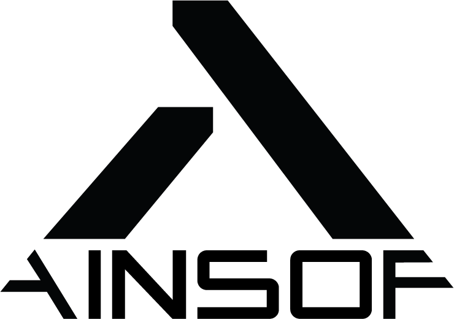

<p align="center">
  <picture>
    <source media="(prefers-color-scheme: dark)" srcset="assets/ainsof-logo-white.png">
    
  </picture>
</p>

<h1 align="center">AINSOF — MCP Server</h1>

<p align="center">
  Original, human-made production music inside your AI assistant.<br/>
  Search it by brief or by reference link, hear full previews, score it to your video,<br/>analyze your edit, pull versions, stems and cue sheets — and clear it, without leaving the tool you already work in.
</p>

<p align="center">
  <a href="https://ainsof.io">ainsof.io</a> ·
  <a href="https://mcp.ainsof.io">mcp.ainsof.io</a> ·
  <a href="https://search.ainsof.io">browse the catalogue</a>
</p>

---

**Endpoint:** `https://mcp.ainsof.io` (Streamable HTTP, no key required)

AINSOF is a music superpowers creative company: a curated, growing production-music
catalogue built for sync, with purpose-made tools for connecting music to picture.
Every cue is written, performed and produced by human composers — nothing in the
catalogue is AI-generated. New original music lands every week.

This server puts the whole catalogue behind 12 MCP tools, so an AI assistant can
find the right cue for a scene, play it, fetch stems and cut-downs, and even return
a finished, professionally scored edit of your video.

## Connect

### Claude (claude.ai / Claude Desktop)
Settings → Connectors → **Add custom connector** → paste `https://mcp.ainsof.io`.

### Claude Code
```bash
claude mcp add --transport http ainsof https://mcp.ainsof.io
```

Or install it as a plugin, which brings the connection **and** a working setup along with it:
```bash
/plugin marketplace add AINSOF-Tech/mcp
/plugin install ainsof
```

## What's in the plugin

The connector on its own gives an assistant twelve tools. The plugin adds the
judgement around them — when to reach for music, which version fits a 22-second
cut, and what to hand over when legal asks for paper.

| | | |
|---|---|---|
| **Skills** | `soundtrack` | Teaches the assistant to offer music on its own the moment a video is edited, rendered or exported — measure the cut, ask for the version that fits that exact length rather than a full track, show three options instead of ten, and never imply a licence that isn't there. |
| | `setup` | Connect and verify the server, raise the rate limit with a free key, and recognise the two replies that look like errors and aren't. |
| **Sub-agent** | `music-supervisor` | Turns a brief into a defensible shortlist — several spots at once, each measured, searched from more than one angle, auditioned, ranked, with the trade-off named and the cue sheet attached. |
| **Commands** | `/score-video` | Measure a cut, find the music, and take it through to a finished score synced to picture. |
| | `/find-music` | Search the catalogue by brief, mood, scene, composer or catalogue number. |
| | `/match-reference` | Paste a Spotify / YouTube / Apple Music / Deezer link and get the closest AINSOF cues, matched by sound. |
| | `/cue-sheet` | Pull writers, splits, ISRC and publisher for a cue you used. |

So a video exported in your session gets a real shortlist without anyone having to
remember to ask for one.

### Cursor
Add to `.cursor/mcp.json` (project) or `~/.cursor/mcp.json` (global):
```json
{
  "mcpServers": {
    "ainsof": { "url": "https://mcp.ainsof.io" }
  }
}
```

### Grok
Connectors → add a remote MCP connector with `https://mcp.ainsof.io`.

### ChatGPT
Developer mode → Connectors → add `https://mcp.ainsof.io`.

## What it can do

| Tool | What it does |
|---|---|
| `search_music` | Find cues by a written brief, a mood, or an exact track / album / catalogue number |
| `search_by_reference` | Paste a YouTube / Spotify / Apple Music / SoundCloud link — it listens and returns the closest AINSOF cues |
| `find_soundtrack` | Describe your video (length, pace, narration) and get cues that fit it |
| `score_my_video` | Upload a video and get back a professionally scored edit, synced to picture |
| `analyze_video` | Structural analysis of a video: cuts, pacing, sections |
| `get_track` | Full detail for one cue: versions, stems, metadata |
| `listen_link` | A playable link for any cue |
| `get_upload_link` / `deliver_score` | Move video in, get the scored result out |
| `cue_sheet` | Cue-sheet data for anything you used |
| `about_ainsof` | Licensing, catalogue and privacy details |
| `feedback` | Tell us when a result was right or wrong (with your consent) |

Previews are always the complete piece, watermarked — cut with them freely before
anything is licensed.

## In practice

**A video editor, mid-edit.** You're cutting a 45-second alpine ski clip in silence.
You tell your assistant: *"fast cuts, no narration — score it."* It calls
`find_soundtrack` with the length and pace, streams you three full previews, and the
one you keep comes back through `score_my_video` already synced to your cut.

**A creative team pitching with a reference.** The client says *"something like Hans
Zimmer's Time."* Paste the link. `search_by_reference` listens to the actual record
and answers with the closest cues in the AINSOF catalogue — playable immediately,
licensable the same day.

**An agency producer clearing a spot.** The edit is locked and legal wants paper.
`get_track` returns every version and stem of the cue you used, `cue_sheet` returns
the cue-sheet data, and licensing is one email — every cue in the catalogue is
pre-cleared, one owner, no chain-of-title archaeology.

**A developer building a creative tool.** Your users edit video in your product.
Point your agent at `https://mcp.ainsof.io` and music discovery — search,
reference matching, previews, scoring to picture — becomes a feature of your app,
with no key required to start.

## Rate limits

| Tier | Calls / day |
|---|---|
| No key | 300 |
| With an API key | 1,000 |
| Need more? | info@ainsof.io |

Keys are free — email **info@ainsof.io**. Send one as a bearer token:

```bash
claude mcp add --transport http ainsof https://mcp.ainsof.io \
  --header "Authorization: Bearer ain_live_…"
```

## Licensing & privacy

The catalogue itself is commercial — every cue is signed, owned and cleared, and
licensing runs through [ainsof.io](https://ainsof.io). This repository contains the
public server manifest and connection docs only, released under the MIT licence
([LICENSE](LICENSE)); what that licence does and does not cover is spelled out in
[NOTICE](NOTICE).

Privacy: the server receives only the tool calls sent to it, never the rest of your
conversation. Full policy: [ainsof.io/privacy.html](https://ainsof.io/privacy.html).

## Contact

**info@ainsof.io** · [ainsof.io](https://ainsof.io)
