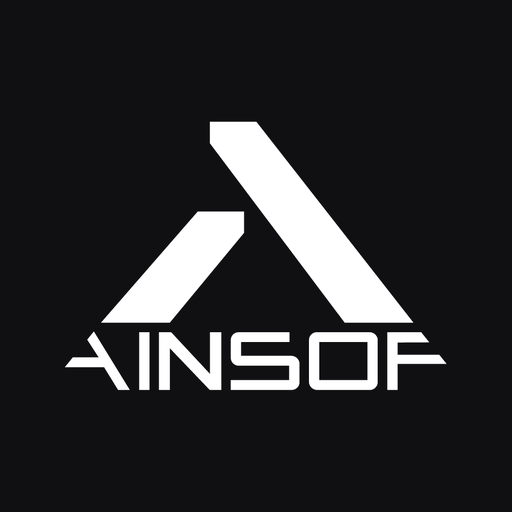

<p align="center">
  
</p>

<h1 align="center">AINSOF Music — MCP Server</h1>

<p align="center">
  Original, human-made production music inside your AI assistant.<br/>
  Search it, hear it, score it to your video, and clear it — without leaving the tool you already work in.
</p>

<p align="center">
  <a href="https://ainsof.io">ainsof.io</a> ·
  <a href="https://mcp.ainsof.io">mcp.ainsof.io</a> ·
  <a href="https://search.ainsof.io">browse the catalogue</a>
</p>

---

**Endpoint:** `https://mcp.ainsof.io/mcp` (Streamable HTTP, no key required)

AINSOF is a music superpowers creative company: a curated, growing production-music
catalogue built for sync, with purpose-made tools for connecting music to picture.
Every cue is written, performed and produced by human composers — nothing in the
catalogue is AI-generated. New original music lands every week.

This server puts the whole catalogue behind 12 MCP tools, so an AI assistant can
find the right cue for a scene, play it, fetch stems and cut-downs, and even return
a finished, professionally scored edit of your video.

## Connect

### Claude (claude.ai / Claude Desktop)
Settings → Connectors → **Add custom connector** → paste `https://mcp.ainsof.io/mcp`.

### Claude Code
```bash
claude mcp add --transport http ainsof https://mcp.ainsof.io/mcp
```

### Cursor
Add to `.cursor/mcp.json` (project) or `~/.cursor/mcp.json` (global):
```json
{
  "mcpServers": {
    "ainsof": { "url": "https://mcp.ainsof.io/mcp" }
  }
}
```

### Grok
Connectors → add a remote MCP connector with `https://mcp.ainsof.io/mcp`.

### ChatGPT
Developer mode → Connectors → add `https://mcp.ainsof.io/mcp`.

## What it can do

| Tool | What it does |
|---|---|
| `search_music` | Find cues by a written brief, a mood, or an exact track / album / catalogue number |
| `search_by_reference` | Paste a YouTube / Spotify / Apple Music / SoundCloud link — it listens and returns the closest AINSOF cues |
| `find_soundtrack` | Describe your video (length, pace, narration) and get cues that fit it |
| `score_my_video` | Upload a video and get back a professionally scored edit, synced to picture |
| `analyze_video` | Structural analysis of a video: cuts, pacing, sections |
| `get_track` | Full detail for one cue: versions, stems, metadata |
| `listen_link` | A playable link for any cue |
| `get_upload_link` / `deliver_score` | Move video in, get the scored result out |
| `cue_sheet` | Cue-sheet data for anything you used |
| `about_ainsof` | Licensing, catalogue and privacy details |
| `feedback` | Tell us when a result was right or wrong (with your consent) |

Previews are always the complete piece, watermarked — cut with them freely before
anything is licensed.

## Try it

Ask your assistant, with the connector on:

> *"Find me something that feels like Hans Zimmer's Time, for a 60-second brand film."*

> *"I'm editing an alpine ski clip, 45 seconds, fast cuts, no narration — score it."*

## Rate limits

| Tier | Calls / day |
|---|---|
| No key | 300 |
| Free API key (`get_api_key` tool) | 1,000 |
| Need more? | info@ainsof.io |

## Licensing & privacy

The catalogue itself is commercial — every cue is signed, owned and cleared, and
licensing runs through [ainsof.io](https://ainsof.io). This repository contains the
public server manifest and connection docs only.

Privacy: the server receives only the tool calls sent to it, never the rest of your
conversation. Full policy: [ainsof.io/privacy.html](https://ainsof.io/privacy.html).

## Contact

**info@ainsof.io** · [ainsof.io](https://ainsof.io)
